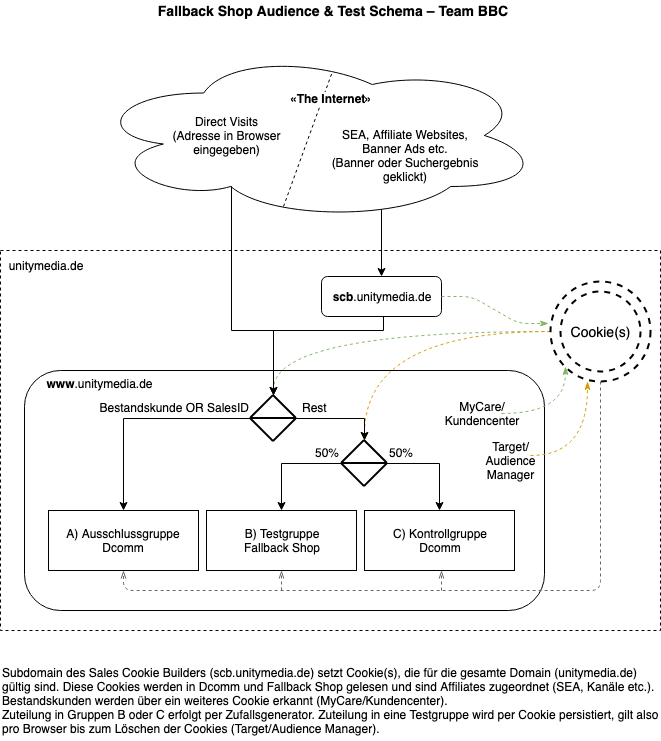

# Dokumentation Fallback Shop ('Alt-X')

**tldr;**
*Der Fallback Shop erhöht die Ausfallsicherheit des Unitymedia Online Sales Frontend und eröffnet neue, weitreichende UX- und Portfolio-Testmöglichkeiten. Er wurde als eigenständig lauffähige Single Page App entwickelt und braucht im Gegensatz zu Dcomm nur eine einzige Backend-Schnittstelle zum Absenden von Bestellungen. Die Performance wurde deutlich verbessert. Das Projekt ist technisch live unter der URL www.unitymedia.de/online-shop/ und kann mittels Adobe Target jederzeit live gestellt werden.*

## Technische Dokumenation für Projekt BBC-30 Fallback-X
Das Projekt wird gelegentlich auch 'Alt-X' für 'Alternative Experience' genannt, ist streng genommen aber nur deren technischer Vorläufer/Unterbau.

Der Fallback Shop ist ein als Single Page App mit dem Javascript Framework Vue.js erstelltes Frontend für den Unitymedia Onlineshop.

Das Projekt ist aktuell (10. April 2019) technisch live unter https://www.unitymedia.de/online-shop?testdebug (ohne den angehängten URL-Parameter wird man zur Standard Homepage umgeleitet, solange der Shop nur als Test Experience ausgespielt wird).

### Ziele und Möglichkeiten
Der Fallback Shop erhöht die Ausfallsicherheit des Unitymedia Online Sales Frontend und eröffnet neue, umfassende UX Testmöglichkeiten. 
Die beiden folgenden Hauptziele wurden erreicht:

1) Alternativer Shop um den Betrieb aufrecht zu erhalten bei größeren Ausfällen in DCOMM.
Möglich aufgrund nur minimaler Abhängigkeiten zu DevOps Setup und Backend Services.

2) Trägersystem für den Test neuer Shop-Konzepte (neue Produkte, radikal andere UX). 
Bauweise erlaubt agile Anpassung des gesamten Shops, d.h. von der Startseite bis zur Danke-Seite und Bestelleingangs-E-Mail ('Ende zu Ende').

**Ausbaumöglichkeiten:**

3) Anbieten von Produkten und Aktionen, die in Dcomm nicht oder nur mit erheblichem Aufwand darstellbar wären, ist leicht möglich. Der Fallback Shop nutzt einen eigenen Produktkatalog ohne Abhängigkeiten zum Backend mit dem man theoretisch beliebige Angebote und Aktionen konfigurieren kann.

4) Erstellung einer Progressive Web App (PWA) auf Basis der vorhandenen Single Page App (SPA). Eine PWA kann SEO-Vorteile bieten und eine native Mobile App überflüssig machen.
Es ist bereits jetzt so, dass für den Fallback Shop keine Mobilgeräteweiche erforderlich ist, da alle Views voll responsiv sind. D.h. es wird schon jetzt keine zweite Variante von Seiten für Darstellung auf Mobilgeräten benötigt.

### Technische Grundlagen
Der Fallback Shop wurde als eigenständig lauffähige Single Page App entwickelt. D.h., es werden nur HTML, CSS, Bilder, Fonts und Javascript benötigt um einen lauffähigen Shop darzustellen. Diese statischen Artefakte werden mit AEM ausgespielt, das HTML auf Basis eines 'Empty Templates', die im HTML und CSS verlinkten Dateien liegen alle im DAM (AEM Digital Asset Manager).
Der Shop könnte aber auf einem beliebigen Webserver, ohne Abhängigkeit zu Backend Technologien oder AEM installiert werden, sofern Zugang zu einer Bestellschnittstelle gegeben wäre.

Ins Backend gibt es nur 2 Schnittstellen, dies sind Service Schnittstellen, die auch Dcomm nutzt (aber eben nur zwei):

1. RFS-Schnittstelle
Sollte diese nicht antworten, wechselt der Fallback Shop auf ein ungeprüftes Adressformular und erlaubt im Gegensatz zu Dcomm den Bestellabschluss. Diese Schnittstelle muss also nicht zwingend verfügbar sein.
2. Form Mail Servlet
Die Dcomm Form Mailer Komponente erlaubt das relativ freie Konfigurieren von E-Mail Schnittstellen. Sie wurde genutzt, um ein Postfach für Bestelleingänge zu konfigurieren und entsprechende Eingangsbestätigungen an den Kunden zurück zu senden. Dies ist die einzige zwingend verfügbare Schnittstelle im Backend, da die Kundenbestellungen natürlich gespeichert werden und für die weitere manuelle Bearbeitung (Bestelleingabe in RNS durch Telesales Agenten) aufrufbar sein müssen. 

### Performance
Die Performance ist technisch wie auch in der Wahrnehmung deutlich besser als bei Dcomm. Der komplette Neukunden Produktkatalog wird komprimiert zusammen mit dem Fallback Shop ausgeliefert. Dies erspart die unsinnige Hin-und-Her-Kommunikation des Dcomm Baskets. Conflict Layer wurden abgeschafft, ein neues Breitband Produkt überschreibt einfach das vorher gewählte (wer bestellt schon mehrere Internetanschlüsse auf einmal?).

Falls  er RFS-Service nicht antwortet, dann springt automatisch ein statisches Anschlussadressformular ein und der Bestellvorgang kann ohne Unterbrechung fortgesetzt werden.

Ladezeiten und Bandbreite werden im Vergleich zu Dcomm um ein Vielfaches reduziert, da in der Single Page App nur ein einziger Ladevorgang nötig ist und keine redundanten Inhalte übertragen werden wie beim Neuladen von Seiten in Dcomm. 

### Sicherheit
Extrem hohe Ausfallsicherheit, da Abhängigkeiten in das notorisch instabile Backend auf das absolute Minimum reduziert wurden. Die Frontend Assets müssen an der gewünschten URL ausgeliefert werden, d.h. Dispatcher/CDN und DAM müssen erreichbar sein. Im Backend muss einzig das Form Mail Servlet funktionieren. Solange man den Fallback Shop per Target Experience ausspielt, müssen Adobe Target und audience Manager natürlich funktionieren.

Auch die Datensicherheit bzw. die Sicherheit gegen Angriffe von außen ist hoch. Ein professioneller Penetration Test kam zu dem Ergebnis, dass nur die E-Mail Schnittstelle durch eine Denial of Service Attacke oder automatisierte Spam Attacken angreifbar wäre. Diese Risiken bestehen jedoch grundsätzlich für Dcomm und alle Formulare der Website. Es wurden keine neuen Angriffsvektoren geschaffen. 

Da der Fallback-Shop per Adobe Target ausgespielt wird, wäre er im Zweifelsfall per Knopfdruck sofort abschaltbar (d.h. man würde zu 100% Dcomm zurückkehren). Umgekehrt erlaubt diese Art der Ausspielung auch seinen Einsatz zur Lastreduktion bis hin zum Ersatz von Dcomm, falls es dort zu größeren Störungen käme.

### Einschränkungen
Der Fallback Shop nutzt nur Frontend Technologie, d.h. statische Assets wie HTML und Javascript. Eine Autorisation gegen MyCare und das Auslesen von Informationen zu Bestandskunden ist damit heute noch nicht möglich. Solange keine Schnittstelle erstellt wird, die eine Client-to-Server Kommunikation vollumfänglich erlaubt, kann der Fallback Shop streng genommen nur Neukunden-Angebote abbilden.

Eine Third Party API existiert, die Bestellungen durch externe Websites wie Verivox und Check24 erlaubt. Diese wurde aber nicht geöffnet für Client-to-Server Zugriffe (i.d.R. Ajax Requests). Automatisierte Bestellerfassung ist daher noch nicht möglich, statt dessen werden Bestellungen per interner E-Mail (Unitymedia Exchange) an Telesales Agenten zugestellt. Dieses eröffnet allerdings auch Chance, neuartige, noch nicht im Backend konfigurierte, Angebote zu machen.

SEO und Analytics sind bei einer SPA etwas erschwert, bzw. erfordern Anpassungen. Wenn agiler Zugriff auf Webserver Rewrite Rules bestünde (eigenes Backend?), wäre hier einiges leichter. Solange per Target ausgespielt wird, ist dies aber nicht kritisch.

### Testing
Die offensichtlichen Vorteile der Technik des Fallback Shops müssen vom Kunden wahrgenommen werden. Das heißt konkret, der Fallback Shop muss in einem A/B-Test bestehen, bevor er für den regulären Betrieb freigegeben werden kann. Dieser Test gestaltet sich etwas komplexer als eine reiner A/B-Test, aufgrund des unterschiedlichen technischen Fundaments (konventionelle Website versus Single Page App) und weil der Fallback Shop noch nicht auf Bestandskunden abzielt.

Hier kommt daher ein Experience Testing zum Einsatz. Der gesamte Traffic wird von Audience Manager gefiltert. Besucher, die anhand gesetzter Cookies als zur Gruppe der Bestandskunden zugehörig erkannt werden, werden vom Testausgeschlossen und landen in der gewöhnlichen Dcomm-Experience.
In den technischen Generalproben werden so vorläufig auch noch die über Affiliates kommenden und anderer Traffic mit SalesID abgeschöpft.
Der verbleibende Rest der Besucher wird nach dem Zufallsprinzip wie in einem üblichen A/B-Test zwischen einer Kontrollgruppe (Dcomm) und der eigentlichen Testgruppe (Fallback Shop) aufgeteilt.

### Potential
1. Wenn eine Third Party Sales API bereitgestellt wird, die Client-to-Server also XHR-Request aus dem Frontend (Ajax) erlaubt, dann kann der Fallback Shop den vollen Leistungsumfang anderer Partnershops bzw. von Dcomm selbst abbilden. D.h. Bestandskundenerkennung mit 'next best offer', Abstimmung auf Details zum Kabelanschluss (MDU/SDU) etc.

2. Der Fallback Shop setzt in allen seinen Views das 'mobile first' Paradigma um, d.h. er ist voll responsiv und braucht keine Mobilgeräteweiche mehr. Dies eröffnet die Option, ihn in Richtung Progressive Web App auszubauen. Damit würde SEO einen Schub bekommen und eine dedizierte/native Mobile App würde sich erübrigen. 

3. Der Fantasie sind keine Grenzen gesetzt: Der Fallback Shop kann alles verkaufen. Einfaches Beispiel: 'Virtual 4play' (nein, das soll keine Ferkelei sein, sondern sowas wie Unitymedia 3play plus Vodafone Mobilfunk) ist möglich, sobald die Agenten neben Zugang zum Unitymedia Telesales Tool auch den zum Vodafone Telesales Tool haben.

### Development, Deployment und Wartung
Der Code für den Fallback Shop liegt in einem privaten Bitbucket Git Repository. Entwickelt wird rein auf Basis aktueller, weit verbreiteter Open Source Tools (NPM/Yarn, WebPack) und Frameworks Vue.js. Es kommt im Fallback Shop keinerlei proprietäre Technik zum Einsatz. Anbindungen an Tealium für das Affiliate Marketing und an Adobe Analytics für das Business Reporting wurden implementiert.

Der Shop wird lokal entwickelt (lokaler Server mit Hot Reloading dank WebPack) und gebaut. Beim Bauen entstehen kompakte Javascript- und CSS-Dateien, die in einem HTML-Dokument eingebunden werden. CSS- und JS-Dateien werden im AEM DAM abgelegt. Das HTML-Dokument kann an beliebiger Stelle in AEM eingebaut werden (aktuelle URL: /online-shop), dazu wird ein Empty Template verwendet, damit man den unnötigen Code-Ballast aus den Dcomm-Templates vermeidet.

Die Fallback Shop Single Page App bildet alle Breitbandproduktseiten und die komplette Bestellstrecke ab. Per Adobe Target wird sichergestellt, dass Seitenbesucher entweder Dcomm oder Fallback Shop nutzen. Wurde ein Kunde schon beim Betreten der Seite oder nach Einloggen als Bestandskunde erkannt, wird er aus der Fallback Experience herausgefiltert und nutzt die übliche Dcomm Experience.
Durch das oben beschrieben sehr agile Deployment als Custom Code in einem Empty Template, können jederzeit neue Releases per AEM eingespielt werden. So kann der Fallback Shop inhaltlich laufend auf gleichem Stand wie Dcomm gehalten werden. Es gibt keine Einschränkungen durch Release Management, Sprint-Zyklen oder Abhängigkeiten zu Software Paketen von dritter Seite.

### Technische Details
Der Shop ist technisch live unter der URL www.unitymedia.de/online-shop/. Er wird ausgespielt per Adobe Target, zum einen um für reguläre A/B-Tests zur Verfügung zu stehen, zum anderen um als Fallback bei schwereren Incidents (z.B. Ausfall RFS Check oder Submit Order Service) schnell verfügbar zu sein.

Um den Shop für Suchmaschinen unsichtbar zu machen und außerhalb von Test- oder Fallback-Szenarios nicht zugänglich zu halten, ist außerhalb regulärer Deployment-Szenarios der Zugriff nur mit angehängtem URL-Parameter möglich: www.unitymedia.de/online-shop?testdebug.

Der Shop besteht im wesentlichen nur aus vier (4) Dateien, einer HTML-Datei, einer CSS-Datei und je einer Javascript-Datei für das Javascript Framework mit eingebundenen Modulen, sowie einer Javascript-Datei mit Logik und UI für den eigentlichen Fallback Shop. Darüber hinaus werden aus dem Digital Asset Manager natürlich noch Font-Dateien und Grafiken nachgeladen (siehe Schema oben bei 'Technische Grundlagen'). Weitere Business-Logik wird durch externe Scripts eingebunden (Adobe Analytics und Tealium für Affiliate Marketing) – hierbei werden dieselben Skripte wie in Dcomm verwendet, um keine Aufwände im Betrieb zu doppeln.

Die Single Page App benötigt zur Darstellung der gesamten Bestellstrecke und der Produktexploration des vollständigen Breitband-Produktkatalogs nur einen Bruchteil der Bandbreite der konventionellen Dcomm Website. Die SPA enthält alle Views in kompakter From (keine Bandbreitenverschwendung durch Mehrfachübertragung von HTML-Templates), den kompletten Produktkatalog (keine endlosen Server-Roundtrips wie in Dcomm) und hat mit dem Form Mail Servlet eine einzige zwingende Abhängigkeit ins Backend.

Bei einer ausgedehnten Produktexploration (Ansehen mehrerer Produktdetailseiten) verschiebt sich das Bandbreitenverhältnis noch weiter zu Ungunsten von Dcomm.

Mit der Anbindung an den RFS-Check gibt es zwar einen zweiten Berührungspunkt zu einem Dcomm-Servlet, dieses ist aber durch einen integrierten Rückfallmechanismus abgesichert. D.h., wenn der Dcomm RFS-Check ausfällt, wird im Fallback Shop automatisch ein alternatives Formular zur Erfassung der Anschlussadresse eingeblendet. Diese (noch ungeprüfte) Adresse wird zusammen mit der Bestellung per Mail an Cluj/Telesales gesendet und dort von einem Agenten nachträglich validiert.

Die beiden E-Mails, die von einer Bestellung im Fallback Shop ausgelöst werden, sind konfigurierbar durch eine Dcomm Form Mail Komponente, die [auf einer nichtöffentlichen Seite](http://172.16.8.197:4502/cf#/content/dcomm-unitymedia-de/de/onlineshop/da39a3ee5e6b4b0d3255bfef95601890afd80709/DONOTDELETE.html) liegt.

**Solange das Form Mail Servlet funktioniert, Digital Asset Manager und AEM-Dispatcher/CDN erreichbar sind, kann der Fallback Shop eingesetzt werden, selbst wenn der Rest des Backends und die übrigen Dcomm Services ausgefallen sein sollten.**

### Ausblick
**Jetzt liegt es bei euch. Was könnt ihr euch für die Zukunft der Website vorstellen?** 
Eine auf einen bestimmten Marketing Kanal abgestimmte Version mit Branding (WM-Shop, Oster-Angebot, Social Media Shop durchsetzt mit Video-Testimonials aus dem UM Youtube-Kanal...) – kein Problem. Neue Shop-Konzepte (Eazy 2.0, B2B Shop, ...) für den Eigenvertrieb, für Premium-Partnershops oder für externe Partner (Amazon Powerseller, Ebay-Partnershop...) ausprobieren? Auf Basis des Fallback Shops innerhalb kürzester Zeit realisierbar.

[The future is so bright, I gotta wear shades...](https://www.youtube.com/watch?v=8qrriKcwvlY) 😎☀️

(Dieser Text ist in ähnlicher Form auch in [Confluence](https://confluence-it.unitymedia.de/pages/viewpage.action?pageId=25267742) zu finden.)